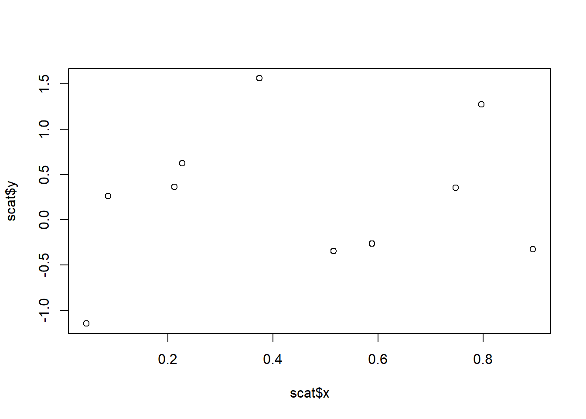
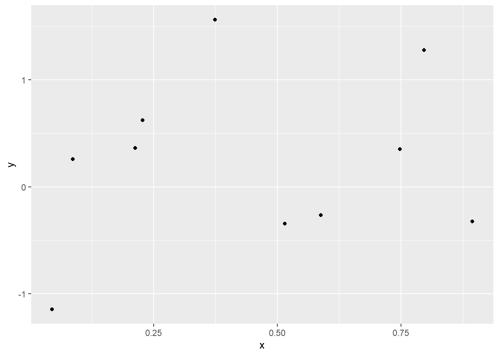

# Basic operations
Simple examples to get you started ...

Set up
------

## 1. Load the libraries used by this tutorial

<!-- -->

    #survey analysis
    library('survey')
    library('srvyr')

    #data manipulation
    library('dplyr')
    library('data.table')

    #other
    library('ggplot2')

## 2. Prep the various datasets and permutations. 
Data is coming from the survey package.

<!-- -->

    data(api)

    #Prep the datasets
    dat_dplyr <- apiclus1
    dat_dt <- setDT(copy(apiclus1))
    dat_svy <- as_survey_design(apiclus1, dnum, weights = pw, fpc = fpc)

### A: Compute Mean, SE, and CI
------
    #dplyr
    dat_dplyr %>% summarize(est = mean(api00), se = sd(api00)/sqrt(n())) %>% 
      mutate(lci = est - 1.96 * se, uci = est + 1.96 *se)

    ##        est       se      lci      uci
    ## 1 644.1694 7.817181 628.8477 659.4911

    #data.table
    dat_dt[
             , .(est = mean(api00), se = sd(api00)/sqrt(.N))
           ][ #chain the operations together-- couple all be 1 line
             , .(est, se, lci = (est - 1.96 * se), uci = (est + 1.96 * se))
            ]

    ##         est       se      lci      uci
    ## 1: 644.1694 7.817181 628.8477 659.4911

    #srvyr
    dat_svy %>% summarize(est = survey_mean(api00), ci = survey_mean(api00, vartype = 'ci')[2:3]) %>%
      rename(se = est_se ,lci = ci_low, uci = ci_upp)

    ## # A tibble: 1 x 4
    ##     est    se   lci   uci
    ##   <dbl> <dbl> <dbl> <dbl>
    ## 1  644.  23.5  594.  695.

### B: Groups summaries
------
    #dplyr
    dat_dplyr %>% group_by(stype) %>% 
      summarize(est = mean(api00), se = sd(api00)/sqrt(n()))

    ## # A tibble: 3 x 3
    ##   stype   est    se
    ##   <fct> <dbl> <dbl>
    ## 1 E      649.  8.85
    ## 2 H      619. 25.9 
    ## 3 M      631. 21.8

    #data.table
    dat_dt[, .(est = mean(api00), se = sd(api00)/sqrt(.N)), keyby = 'stype']

    ##    stype      est        se
    ## 1:     E 648.8681  8.847013
    ## 2:     H 618.5714 25.854987
    ## 3:     M 631.4400 21.812770

    #srvyr
    dat_svy %>% group_by(stype) %>% summarize(est = survey_mean(api00))

    ## # A tibble: 3 x 3
    ##   stype   est est_se
    ##   <fct> <dbl>  <dbl>
    ## 1 E      649.   22.4
    ## 2 H      619.   38.0
    ## 3 M      631.   31.6

### C: Merge datasets
------
    #create two datasets to merge
    m_base <- data.frame(letter = c('A','A','B', 'C'))
    m_new <- data.frame(letter = c('A','B', 'D'), num = 1:3)

    #basic merge (data.frame or data.table)
    merge(m_base, m_new, by = 'letter') #inner join

    ##   letter num
    ## 1      A   1
    ## 2      A   1
    ## 3      B   2

    merge(m_base, m_new, by = 'letter', all.x = T) #left join

    ##   letter num
    ## 1      A   1
    ## 2      A   1
    ## 3      B   2
    ## 4      C  NA

    merge(m_base, m_new, by = 'letter', all = T)

    ##   letter num
    ## 1      A   1
    ## 2      A   1
    ## 3      B   2
    ## 4      C  NA
    ## 5      D   3

### D: Recode variables (in data.table)
------
    #create a small dataset
    rec <- dat_dt[1:5, .(sname, stype, api00)]

    #Via Merge into a new variable
    school <- data.frame(stype = c('E', 'H', 'M'), stype_name = c('Elem', 'High', 'Middle'))
    rec_m <- merge(rec, school, by = 'stype', all.x = T)
    rec_m[]

    ##    stype                      sname api00 stype_name
    ## 1:     E        Garfield Elementary   684       Elem
    ## 2:     E       Jefferson Elementary   612       Elem
    ## 3:     E Madison (James) Elementary   710       Elem
    ## 4:     E        McKinley Elementary   729       Elem
    ## 5:     H           San Leandro High   608       High

    #Overwrite
    rec_new <- copy(rec_m)
    rec_new[, c('stype', 'stype_name') := .(stype_name, NULL)]
    rec_new[]

    ##    stype                      sname api00
    ## 1:  Elem        Garfield Elementary   684
    ## 2:  Elem       Jefferson Elementary   612
    ## 3:  Elem Madison (James) Elementary   710
    ## 4:  Elem        McKinley Elementary   729
    ## 5:  High           San Leandro High   608

    #subsetting
    rec_s = copy(rec)
    rec_s[stype == 'E', stype_name := 'Elem']
    rec_s[stype == 'H', stype_name := 'High']
    rec_s[]

    ##                         sname stype api00 stype_name
    ## 1:           San Leandro High     H   608       High
    ## 2:        Garfield Elementary     E   684       Elem
    ## 3:       Jefferson Elementary     E   612       Elem
    ## 4: Madison (James) Elementary     E   710       Elem
    ## 5:        McKinley Elementary     E   729       Elem

### E: Basic flow control
------
    #if, else if, and else
    t <- 1
    if(t == 0){
      0
    }else if(t == 1){
      1
    }else{
      2
    }

    ## [1] 1

    #For loop
    list_to_iterate <- 1:3
    for(item in list_to_iterate){
      print(item)
    }

    ## [1] 1
    ## [1] 2
    ## [1] 3

    #while loop
    i = 1
    while(i < 4){
      print(i)
      i <- i+1
    }

    ## [1] 1
    ## [1] 2
    ## [1] 3

### F: Functions
------
    funky = function() 'get jiggy with it'
    funky()

    ## [1] "get jiggy with it"

    dance = function(x) rep('Dance', x)
    dance(1)

    ## [1] "Dance"

    dance(5)

    ## [1] "Dance" "Dance" "Dance" "Dance" "Dance"

### G: Scatter plots
------
    scat = data.frame(x = runif(10), y = rnorm(10))

    #Base R
    plot(scat$x, scat$y)

    #ggplot
    ggplot(scat, aes(x = x , y = y)) + geom_point()

